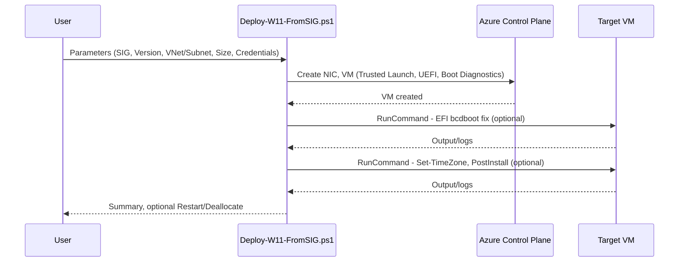

# Azure Virtual Desktop – Golden-Image Pipeline (Windows 11, SIG)

This repository provides a **full image lifecycle for Windows 11 Azure Virtual Desktop (AVD)**:

1. **Golden-Image → Azure Compute Gallery (SIG) Version**
2. **SIG Version → VM Deployment (Trusted Launch, Secure Boot, vTPM, optional EFI-Bootfix, Post-Install)**

The pipeline is **non-destructive**: the Golden-Image VM remains untouched (snapshot-based).

---

## 📑 Table of Contents
- Goals & Overview
- Repository Structure
- Supported Scenarios
- Prerequisites
- RBAC Roles & Permissions
- Module Installation
- Quickstart – End-to-End
- Architecture & Flows (Mermaid)
- Script 1: Publish-GalleryVersionFromGoldenVM.ps1  
  Purpose, Parameters, Examples, Outputs, Cleanup, Edge-Cases
- Script 2: Deploy-W11-FromSIG.ps1  
  PSScriptInfo, Purpose, Parameters, Examples, EFI-Bootfix, Post-Install, Multi-Session
- Naming & Tagging Conventions
- Operations & AVD Integration (VMSS/Hostpool)
- Troubleshooting
- Validation Checklists
- CI/CD Integration (Azure DevOps / GitHub Actions)
- Security & Compliance
- Cost Notes
- Versioning & Release Notes
- FAQ
- License & Credits

---

## 🎯 Goals & Overview
- Automated, reproducible image lifecycle for Windows 11 AVD
- Non-destructive: Golden-Image stays untouched (snapshot staging)
- Supports Trusted Launch / Gen2 / vTPM / Secure Boot
- Efficient replication into Azure Compute Gallery (SIG) with configurable Storage-Tier & ReplicaCount
- Fast VM deployment from SIG versions, incl. optional EFI bootloader repair

---

## 📂 Repository Structure
```
.
├─ Publish-GalleryVersionFromGoldenVM.ps1   # Golden VM → Managed Image → SIG Version
└─ Deploy-W11-FromSIG.ps1                   # SIG Version → VM (Trusted Launch, Post-Install, EFI-Fix)
```

---

## 💡 Supported Scenarios
- Creation of consistent AVD session hosts from validated Windows 11 images
- Rollout of new SIG versions across multiple regions
- Deployment of test/pilot VMs with Post-Install automation (scripts, timezone)
- Image maintenance: fast, safe iteration without breaking the Golden-Image

---

## 🔧 Prerequisites
- Windows PowerShell 5.1 or PowerShell 7.x
- Az modules: `Az.Accounts`, `Az.Compute`, `Az.Network`, `Az.Resources`
- Golden-Image VM: Windows, Azure VM Agent installed
- Existing VNet/Subnet for staging VM (no Public IP required)
- Azure Compute Gallery (SIG) exists or will be created interactively/automatically

---

## 🔑 RBAC Roles & Permissions

| Scope                  | Recommended Role(s)         | Purpose                                           |
|-------------------------|-----------------------------|---------------------------------------------------|
| Source RG (Golden)     | Reader (minimum)            | Read OS disk, create snapshot                     |
| Staging RG             | Virtual Machine Contributor | Create Staging VM, NIC, Disk, Snapshot, Managed Image |
| Gallery RG             | Compute Gallery Contributor | Create/read image definitions and versions        |
| Network (VNet/Subnet)  | Network Contributor         | Create NIC, assign subnet                         |

**Best practice:** use Service Principals with least privilege; secrets/certs in Key Vault.

---

## 📥 Module Installation
```powershell
# Once, as Administrator
Install-Module Az -Scope AllUsers -Repository PSGallery -Force

# Or specific modules:
Install-Module Az.Accounts,Az.Compute,Az.Network,Az.Resources -Scope AllUsers -Force
```

---

## 🚀 Quickstart – End-to-End

### 1. Golden-Image → SIG Version
```powershell
.\Publish-GalleryVersionFromGoldenVM.ps1 `
  -SubscriptionId "00000000-0000-0000-0000-000000000000" `
  -Location "westeurope" `
  -SourceVmName "W11-GOLD" -SourceVmRg "RG-Golden" `
  -StagingRg "RG-ImageStaging" `
  -VnetName "vnet-staging" -VnetRg "RG-Network" -SubnetName "snet-staging" `
  -ImageVersion "2025.08.18" `
  -TargetRegions @("westeurope","northeurope") -ReplicaCount 2 `
  -StorageAccountType "Standard_LRS" `
  -CleanUp
```

### 2. SIG Version → VM
```powershell
$cred = Get-Credential
.\Deploy-W11-FromSIG.ps1 `
  -SubscriptionId "00000000-0000-0000-0000-000000000000" `
  -Location "westeurope" `
  -RgTarget "RG-Prod" -VnetName "vnet1" -SubnetName "snet1" `
  -VmName "W11-APP-01" `
  -GalleryName "sig-prod" -GalleryResourceGroup "RG-Gallery" `
  -ImageDefinitionName "W11-AVD" -ImageVersionName "2025.08.18" `
  -VmSize "Standard_D8ds_v5" -AdminCredential $cred -Force
```

---

## 🏗 Architecture & Flows (Mermaid)

### Full Process
```mermaid
flowchart LR
  A[Golden VM (Windows 11)] --> B(Snapshot OS Disk)
  B --> C(Staging OS Disk)
  C --> D[Staging VM (Gen2/TrustedLaunch same as source)]
  D -->|RunCommand| E[Sysprep /generalize /oobe /shutdown /mode:vm]
  E --> F[VM deallocate + generalized]
  F --> G[Managed Image (generalized)]
  G --> H[SIG Image Version (Replica, Tier, Regions)]
  H --> I[Deploy VM(s) from SIG]
```

### Deploy-VM (EFI-Fix & Post-Install)


---

## 📜 License & Credits
- License: [MIT](https://opensource.org/licenses/MIT)
- © 2025 Jörg Brors – Scripts & Documentation
- With assistance/review from AI assistants
