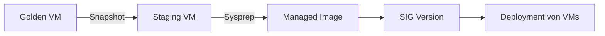

# Azure Virtual Desktop – Golden Image Pipeline

Dieses Repository enthält zwei PowerShell-Skripte, um **Windows 11 AVD Golden Images** zu verwalten:

1. **Publish-GalleryVersionFromGoldenVM.ps1**  
   → erstellt aus einer Golden-Image-VM eine **neue Azure Compute Gallery (SIG) Version** (non-destructive).

2. **Deploy-W11-FromSIG.ps1**  
   → erstellt eine **VM aus einer SIG-Version**, inkl. Trusted Launch, vTPM, EFI-Bootfix und optionalen Post-Install-Schritten.

---

## 📋 Features

- 🖼 **Image Lifecycle**: Golden VM → Sysprep → Managed Image → SIG-Version  
- 🔒 **Trusted Launch / Secure Boot / vTPM** Unterstützung  
- ⚡ **Accelerated Networking** (falls unterstützt)  
- 🛠 **EFI-Bootfix** via RunCommand (optional)  
- 🧹 Automatisches Aufräumen von Staging-Ressourcen  
- 📜 Erweiterte Optionen: Post-Install-Skripte, TimeZone-Setzung, Multi-Session Host Lizenzierung  

---

## 🛠 Voraussetzungen

- Windows PowerShell 5.1 oder PowerShell 7.x  
- Module: `Az.Accounts`, `Az.Compute`, `Az.Network`, `Az.Resources`  
- Berechtigungen:  
  - VM Contributor / Reader auf Source-RG  
  - Contributor auf Staging-RG  
  - Compute Gallery Contributor auf Gallery-RG  
  - Network Contributor für VNet/Subnet  

---

## 🔄 Workflow Übersicht



---

## 📑 Skript 1: Publish-GalleryVersionFromGoldenVM.ps1

### Zweck
Erstellt **non-destructive** eine neue SIG-Version aus einer bestehenden Golden-Image-VM.

### Beispiel

```powershell
.\Publish-GalleryVersionFromGoldenVM.ps1 `
  -SubscriptionId "00000000-0000-0000-0000-000000000000" `
  -Location "westeurope" `
  -SourceVmName "W11-GOLD" -SourceVmRg "RG-Golden" `
  -StagingRg "RG-ImageStaging" `
  -VnetName "vnet-staging" -VnetRg "RG-Network" -SubnetName "snet-staging" `
  -ImageVersion "2025.08.18" `
  -TargetRegions @("westeurope","northeurope") -ReplicaCount 2 `
  -StorageAccountType "Standard_LRS" -CleanUp
```

### Parameter (Auswahl)

| Parameter               | Beschreibung                                                                 |
|--------------------------|-------------------------------------------------------------------------------|
| `-SourceVmName`         | Name der Golden-Image-VM                                                     |
| `-SourceVmRg`           | Resource Group der Golden-Image-VM                                           |
| `-StagingRg`            | Resource Group für temporäre Staging-Ressourcen                              |
| `-ImageVersion`         | Neue Image-Version (z. B. `2025.08.18` oder `1.0.42`)                        |
| `-TargetRegions`        | Liste von Regionen, in die repliziert wird                                   |
| `-ReplicaCount`         | Anzahl Replikate pro Region                                                  |
| `-CleanUp`              | Entfernt Staging-Ressourcen nach erfolgreicher Image-Erstellung              |

---

## 📑 Skript 2: Deploy-W11-FromSIG.ps1

### Zweck
Erstellt eine VM aus einer bestehenden SIG-Version, inkl. Trusted Launch und optionalem EFI-Bootfix.

### Beispiele

#### Nicht-interaktiv
```powershell
$cred = Get-Credential
.\Deploy-W11-FromSIG.ps1 `
  -SubscriptionId "..." -Location "westeurope" -RgTarget "RG-Prod" `
  -VnetName "vnet1" -SubnetName "snet1" `
  -VmName "W11-APP-01" `
  -GalleryName "sig-prod" -GalleryResourceGroup "RG-Gallery" `
  -ImageDefinitionName "W11-AVD" -ImageVersionName "1.2.0" `
  -VmSize "Standard_D8ds_v5" `
  -AdminCredential $cred -Tags @{Project="Demo"} -Force
```

#### Interaktiv (SIG/Definition/Version wählen)
```powershell
.\Deploy-W11-FromSIG.ps1 `
  -SubscriptionId "..." -Location "westeurope" `
  -RgTarget "RG-Prod" -VnetName "vnet1" -SubnetName "snet1" `
  -VmName "W11-INT-01"
```

#### Mit Post-Install Script und Restart
```powershell
$cred = Get-Credential
.\Deploy-W11-FromSIG.ps1 `
  -SubscriptionId "..." -Location "westeurope" -RgTarget "RG-Prod" `
  -VnetName "vnet1" -SubnetName "snet1" `
  -VmName "W11-CUSTOM01" -AdminCredential $cred `
  -PostInstallScriptPath "C:\scripts\setup.ps1" -ForceRestart -Force
```

### Parameter (Auswahl)

| Parameter                   | Beschreibung                                                                 |
|------------------------------|-------------------------------------------------------------------------------|
| `-VmName`                   | Name der zu erstellenden VM                                                 |
| `-GalleryName`              | Name der Shared Image Gallery                                               |
| `-ImageDefinitionName`      | Name der Image Definition in der Gallery                                    |
| `-ImageVersionName`         | Version des Images (z. B. `1.2.0`)                                          |
| `-EnableTrustedLaunch`      | Aktiviert SecureBoot & vTPM (Standard: aktiv)                               |
| `-SkipBootFix`              | Überspringt den EFI-Bootfix                                                 |
| `-PostInstallScriptPath`    | Lokales PowerShell-Skript, das nach Deployment ausgeführt wird               |
| `-TimeZone`                 | Zeitzone setzen (z. B. `"W. Europe Standard Time"`)                         |
| `-MultiSessionHost`         | Setzt Lizenztyp auf `Windows_Client` (für AVD Multi-Session)                |
| `-ForceRestart` / `-ForceStop` | Startet oder stoppt die VM nach Deployment automatisch                     |

---

## ✅ Best Practices

- Golden-Image-VM **vorher bereinigen**: Updates, keine Pending Reboots, keine Benutzerprofile.  
- **AppX/Provisioned Packages** entfernen, die Sysprep blockieren können.  
- Namenskonventionen beachten (≤15 Zeichen, gültige NetBIOS).  
- Mit `-ExcludeFromLatest` nur getestete Images produktiv verwenden.  

---

## 📜 Lizenz

[MIT License](https://opensource.org/licenses/MIT) © 2025 Jörg Brors

---

## 🔗 Links

- [Azure Shared Image Gallery](https://learn.microsoft.com/azure/virtual-machines/windows/shared-images)  
- [Trusted Launch](https://learn.microsoft.com/azure/virtual-machines/trusted-launch)  
- [Azure Virtual Desktop](https://learn.microsoft.com/azure/virtual-desktop/)  
