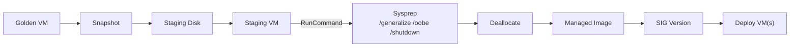
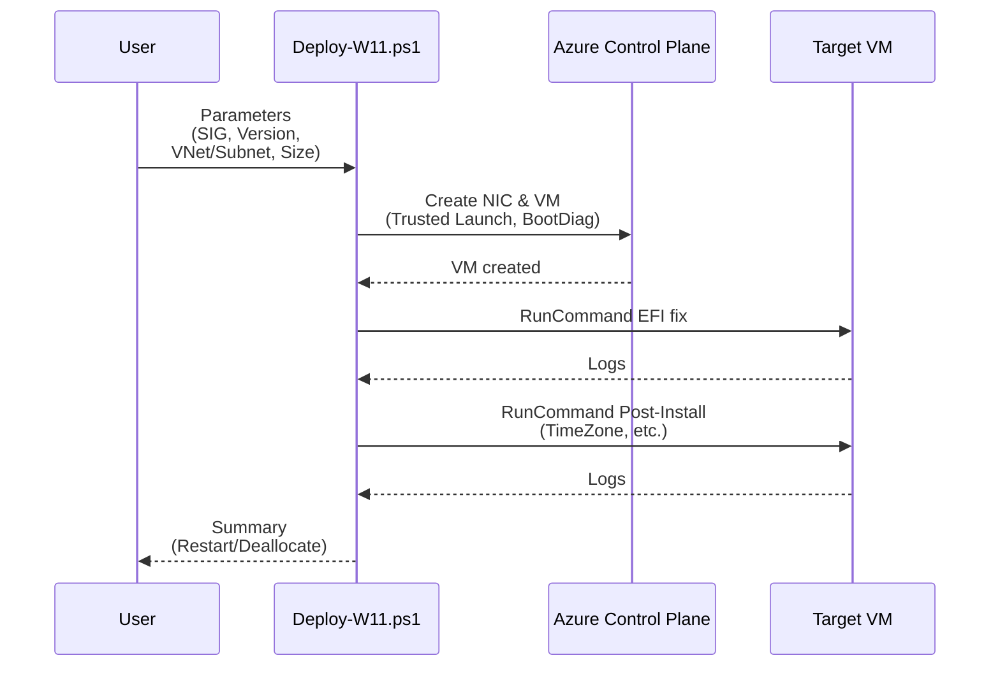

# Azure Virtual Desktop – Golden Image Pipeline (Windows 11, SIG)

This repository contains PowerShell scripts that implement a **complete, non-destructive image lifecycle** for **Windows 11 Azure Virtual Desktop (AVD)**:

1. **`Publish-GalleryVersionFromGoldenVM.ps1`** — Create a new **Azure Compute Gallery (SIG)** image **version** from an existing Golden Image VM.  
2. **`Deploy-W11-FromSIG.ps1`** — Deploy a **VM from a SIG version**, including **Trusted Launch**, **Secure Boot**, **vTPM**, **optional EFI boot fix**, and **optional post‑install** steps.
3. **`Get-OldProfiles.ps1`** — Analyze local Windows user profiles and map them against Active Directory for cleanup and maintenance.

> **Non‑destructive:** The Golden Image VM remains **untouched**. All work happens on a snapshot clone (staging).

---

## Table of Contents

- [Goals & Overview](#goals--overview)
- [Repository Structure](#repository-structure)
- [Supported Scenarios](#supported-scenarios)
- [Prerequisites](#prerequisites)
- [RBAC Roles & Permissions](#rbac-roles--permissions)
- [Module Installation](#module-installation)
- [Quickstart – End-to-End](#quickstart--end-to-end)
- [Architecture & Flows (Mermaid)](#architecture--flows-mermaid)
- [Script 1: Publish-GalleryVersionFromGoldenVM.ps1](#script-1-publish-galleryversionfromgoldenvmps1)
- [Script 2: Deploy-W11-FromSIG.ps1](#script-2-deploy-w11-fromsigps1)
- [Script 3: Get-OldProfiles.ps1](#script-3-get-oldprofilesps1)
- [Naming & Tagging Conventions](#naming--tagging-conventions)
- [Operations & AVD Integration (VMSS/Hostpool)](#operations--avd-integration-vmsshostpool)
- [Troubleshooting](#troubleshooting)
- [Validation Checklists](#validation-checklists)
- [CI/CD Integration (Azure DevOps / GitHub Actions)](#cicd-integration-azure-devops--github-actions)
- [Security & Compliance](#security--compliance)
- [Cost Notes](#cost-notes)
- [Versioning & Release Notes](#versioning--release-notes)
- [FAQ](#faq)
- [License & Credits](#license--credits)
- [Appendix A – Compact Parameter Reference](#appendix-a--compact-parameter-reference)

---

## Goals & Overview

- Automated, repeatable **image lifecycle** for **Windows 11 AVD**  
- **Non‑destructive** workflow (snapshot staging; source VM is never modified)  
- Honors **Trusted Launch / Gen2 / vTPM / Secure Boot**  
- Efficient **SIG replication** (configurable **Storage Tier** & **ReplicaCount**)  
- Rapid **VM deployment** from SIG versions with optional **EFI bootloader repair** and **post‑install**
- **Profile management** and cleanup for AVD session hosts

---

## Repository Structure

```
.
├─ Publish-GalleryVersionFromGoldenVM.ps1   # Golden VM → Managed Image → SIG Version
├─ Deploy-W11-FromSIG.ps1                   # SIG Version → VM (Trusted Launch, Post-Install, EFI Fix)
└─ Get-OldProfiles.ps1                      # Profile Analysis & AD Mapping for Cleanup
```

---

## Supported Scenarios

- Provision **consistent AVD session hosts** from validated Windows 11 images  
- Roll out **new SIG versions** across regions  
- Deploy **test/pilot VMs** with automated **post-install** (scripts, timezone)  
- **Image hygiene**: quick, safe iteration without breaking the Golden Image
- **Profile maintenance**: identify and clean up old/unused user profiles on AVD hosts

---

## Prerequisites

- **Windows PowerShell 5.1** or **PowerShell 7.x**  
- Az modules: `Az.Accounts`, `Az.Compute`, `Az.Network`, `Az.Resources`  
- Golden Image VM: **Windows** with **Azure VM Agent** installed  
- Existing **VNet/Subnet** for the staging VM (**no Public IP required**)  
- An **Azure Compute Gallery (SIG)** exists or will be created interactively/automatically
- **Domain-joined environment** for profile analysis (Get-OldProfiles.ps1)

---

## RBAC Roles & Permissions

| Scope                 | Recommended Role(s)                  | Purpose                                                |
|-----------------------|--------------------------------------|--------------------------------------------------------|
| Source RG (Golden)    | Reader (minimum)                     | Read OS disk and create **snapshot**                  |
| Staging RG            | Virtual Machine Contributor, Contributor | Create **staging VM**, NIC, disk, snapshot, managed image |
| Gallery RG            | Compute Gallery Contributor          | Create/read **image definitions** & **versions**       |
| Network (VNet/Subnet) | Network Contributor                  | Create NIC and attach to **subnet**                    |
| AVD Session Hosts     | Local Administrator                  | Profile analysis and cleanup operations                |

> Follow **least privilege**. Use **Service Principal**, store secrets/certs in **Key Vault**.

---

## Module Installation

```powershell
# Once, as Administrator
Install-Module Az -Scope AllUsers -Repository PSGallery -Force

# Or specifically:
Install-Module Az.Accounts,Az.Compute,Az.Network,Az.Resources -Scope AllUsers -Force
```

---

## Quickstart – End-to-End

### 1) Golden Image → SIG Version
```powershell
.\Publish-GalleryVersionFromGoldenVM.ps1 `
  -SubscriptionId "00000000-0000-0000-0000-000000000000" `
  -Location "westeurope" `
  -SourceVmName "W11-GOLD" -SourceVmRg "RG-Golden" `
  -StagingRg "RG-ImageStaging" `
  -VnetName "vnet-staging" -VnetRg "RG-Network" -SubnetName "snet-staging" `
  -ImageVersion "2025.08.18" `
  -TargetRegions @("westeurope","northeurope") -ReplicaCount 2 `
  -StorageAccountType "Standard_LRS" `
  -CleanUp
```

### 2) SIG Version → VM
```powershell
$cred = Get-Credential
.\Deploy-W11-FromSIG.ps1 `
  -SubscriptionId "00000000-0000-0000-0000-000000000000" `
  -Location "westeurope" `
  -RgTarget "RG-Prod" -VnetName "vnet1" -SubnetName "snet1" `
  -VmName "W11-APP-01" `
  -GalleryName "sig-prod" -GalleryResourceGroup "RG-Gallery" `
  -ImageDefinitionName "W11-AVD" -ImageVersionName "2025.08.18" `
  -VmSize "Standard_D8ds_v5" -AdminCredential $cred -Force
```

### 3) Analyze Old Profiles
```powershell
.\Get-OldProfiles.ps1 -Days 180 -OnlyDisabled
```

---

## Architecture & Flows (Mermaid)

### End-to-End Process


### Deploy VM (EFI Fix & Post-Install)


---

## Script 1: Publish-GalleryVersionFromGoldenVM.ps1

### Purpose
Create a **new SIG image version** from a Golden Image VM (non‑destructive):  
**Snapshot → Staging Disk → Staging VM → Sysprep → Managed Image → SIG Version**.  
**Trusted Launch/UEFI** is mirrored from the source. Interactive **SIG/definition selection** or **auto‑create** supported.

### Key Parameters

| Parameter                               | Type      | Req. | Description                                                                          |
|-----------------------------------------|-----------|:---:|--------------------------------------------------------------------------------------|
| `-SubscriptionId`                       | string    | ✔   | Target subscription                                                                  |
| `-Location`                             | string    | ✔   | Region (e.g., `westeurope`)                                                          |
| `-SourceVmName`, `-SourceVmRg`          | string    | ✔   | Golden Image VM                                                                      |
| `-StagingRg`                            | string    | ✔   | RG for staging objects (VM, NIC, disks, snapshot, managed image)                     |
| `-VnetName`, `-VnetRg`, `-SubnetName`   | string    | ✔   | Network for staging VM                                                               |
| `-GalleryName`, `-GalleryRg`            | string    | –   | If omitted: interactive selection / creation                                         |
| `-ImageDefinitionName`                  | string    | –   | If omitted: interactive selection / creation                                         |
| `-ImageVersion`                         | string    | ✔   | New version (e.g., `1.2.3` or `YYYY.MM.DD`)                                          |
| `-TargetRegions`                        | string[]  | –   | Replication regions (default: primary region)                                        |
| `-ReplicaCount`                         | int       | –   | Replicas per region (default: 1)                                                     |
| `-StorageAccountType`                   | enum      | –   | `Standard_LRS` (default), `Standard_ZRS`, `Premium_LRS`                              |
| `-ExcludeFromLatest`, `-EndOfLife`      | switch/str| –   | Control “latest” behavior & lifecycle                                                |
| `-CleanUp`                              | switch    | –   | Remove staging resources after successful publish                                    |

### Examples

**Interactive (select or create SIG/definition):**
```powershell
.\Publish-GalleryVersionFromGoldenVM.ps1 `
  -SubscriptionId "..." -Location "westeurope" `
  -SourceVmName "W11-GOLD" -SourceVmRg "RG-Golden" `
  -StagingRg "RG-ImageStaging" `
  -VnetName "vnet-staging" -VnetRg "RG-Network" -SubnetName "snet-staging" `
  -ImageVersion "2025.08.18" -CleanUp
```

**Non-interactive (existing SIG/definition):**
```powershell
.\Publish-GalleryVersionFromGoldenVM.ps1 `
  -SubscriptionId "..." -Location "westeurope" `
  -SourceVmName "W11-GOLD" -SourceVmRg "RG-Golden" `
  -StagingRg "RG-ImageStaging" `
  -VnetName "vnet-staging" -VnetRg "RG-Network" -SubnetName "snet-staging" `
  -GalleryName "sig-prod" -GalleryRg "RG-Gallery" -ImageDefinitionName "W11-AVD" `
  -ImageVersion "1.0.42" -TargetRegions @("westeurope","northeurope") -ReplicaCount 2 `
  -StorageAccountType "Standard_ZRS" -ExcludeFromLatest -CleanUp
```

### Outputs
- **SIG Image Version**: `gallery/imageDefinition/versions/<ImageVersion>`  
- Optional **Managed Image** (removed when `-CleanUp` is used)  
- Console **summary** and **RunCommand** Sysprep logs

### Cleanup
`-CleanUp` removes **staging VM**, **NIC**, **staging disk**, **snapshot**, and **managed image**.

### Edge Cases
- **Sysprep failures**: remove problematic Appx/provisioned packages; review logs (see Troubleshooting).  
- **Replication**: version creation is immediate; replication to target regions continues asynchronously.

---

## Script 2: Deploy-W11-FromSIG.ps1

### PSScriptInfo
Contains your PSScriptInfo header (e.g., `.VERSION 0.1.0`, author **Jörg Brors**).

### Core Features
- Automatic **SIG/definition/version** selection (interactive or non‑interactive)  
- **Trusted Launch** (Gen2, Secure Boot, vTPM) configurable  
- Optional **EFI bootloader repair** via `bcdboot` (`-SkipBootFix` to disable)  
- **Post‑install** script via RunCommand (`-PostInstallScriptPath`)  
- **Time zone** setup (`-TimeZone`, default `W. Europe Standard Time`)  
- **AVD multi‑session** license type `Windows_Client` (`-MultiSessionHost`)  
- Final action: `-ForceRestart` / `-ForceStop` or interactive prompt

### Key Parameters

| Parameter                         | Type        | Req. | Description                                                        |
|-----------------------------------|-------------|:---:|--------------------------------------------------------------------|
| `-SubscriptionId`, `-Location`    | string      | ✔   | Target subscription & region                                       |
| `-RgTarget`                       | string      | ✔   | RG for VM & NIC                                                    |
| `-RgNetwork`                      | string      | –   | RG of VNet (optional; auto-search if omitted)                      |
| `-VnetName`, `-SubnetName`        | string      | ✔   | Network for NIC                                                    |
| `-VmName`                         | string      | ✔   | Base VM name; **sanitized** (≤15 chars, NetBIOS rules)             |
| `-ComputerNameOverride`           | string      | –   | Explicit Windows name (sanitized)                                  |
| `-VmSize`                         | string      | –   | e.g., `Standard_D8ds_v5`                                           |
| `-Tags`                           | hashtable   | –   | Tags applied to VM & NIC                                           |
| `-GalleryResourceGroup`, `-GalleryName` | string | –   | SIG scope (optional if auto-detected)                              |
| `-ImageDefinitionName`, `-ImageVersionName` | string | – | Non‑interactive selection                                          |
| `-EnableTrustedLaunch`            | bool        | –   | Default `$true` (Gen2 / Secure Boot / vTPM)                        |
| `-AdminCredential`                | PSCredential| –   | Local admin of the new VM (prompted if omitted)                    |
| `-SkipBootFix`                    | switch      | –   | Skip EFI boot fix                                                  |
| `-PostInstallScriptPath`          | string      | –   | Local script to run via RunCommand                                 |
| `-TimeZone`                       | string      | –   | Default `W. Europe Standard Time`                                  |
| `-MultiSessionHost`               | switch      | –   | Sets `LicenseType="Windows_Client"`                                |
| `-ForceRestart`, `-ForceStop`, `-Force` | switch | – | Final action / prompt suppression                                  |

### Examples

**Non‑interactive (known SIG/def/version):**
```powershell
$cred = Get-Credential
.\Deploy-W11-FromSIG.ps1 `
  -SubscriptionId "..." -Location "westeurope" `
  -RgTarget "rg-vm" -VnetName "prod-vnet" -SubnetName "snet-app" `
  -VmName "W11-APP-01" `
  -GalleryName "sig-prod" -GalleryResourceGroup "RG-Gallery" `
  -ImageDefinitionName "W11-AVD" -ImageVersionName "1.2.0" `
  -VmSize "Standard_D8ds_v5" -AdminCredential $cred -Tags @{Project='Demo'} -Force
```

**Interactive (select SIG/def/version):**
```powershell
.\Deploy-W11-FromSIG.ps1 `
  -SubscriptionId "..." -Location "westeurope" `
  -RgTarget "rg-vm" -VnetName "prod-vnet" -SubnetName "snet-app" `
  -VmName "W11-INT-01"
```

**Post‑Install & forced restart:**
```powershell
$cred = Get-Credential
.\Deploy-W11-FromSIG.ps1 `
  -SubscriptionId "..." -Location "westeurope" -RgTarget "rg-vm" `
  -VnetName "vnet1" -SubnetName "snet1" `
  -VmName "W11-CUSTOM01" -AdminCredential $cred `
  -PostInstallScriptPath "C:\scripts\setup-roles.ps1" -ForceRestart -Force
```

### EFI Boot Fix
- RunCommand executes **`bcdboot`** against the **ESP** and sets **`bcdedit /timeout 0`**.  
- Disable with `-SkipBootFix` if your image does not require the repair.

### Multi-Session (AVD)
- With `-MultiSessionHost` the script sets `LicenseType = "Windows_Client"` (required for **Windows 11 multi‑session**).  
- Ensure proper licensing in **M365/AVD**.

---

## Script 3: Get-OldProfiles.ps1

### Purpose
Analyzes local Windows user profiles on AVD session hosts and maps them against Active Directory to identify old, unused profiles for cleanup. **No RSAT required** - uses .NET DirectoryServices for AD queries.

### Core Features
- **Profile Discovery**: Scans `C:\Users\*` for local user profiles
- **AD Integration**: Maps profiles to AD users via SID lookup across all domain controllers
- **Registry Analysis**: Reads ProfileList registry keys including load/unload timestamps
- **Smart Filtering**: Excludes system profiles (Default, Public, Administrator)
- **Flexible Reporting**: Full report or candidates-only output
- **CSV Export**: Optional export for further analysis
- **Time Calculation**: Shows days since last effective logon

### Key Parameters

| Parameter                | Type      | Default | Description                                           |
|--------------------------|-----------|---------|-------------------------------------------------------|
| `-Days`                  | int       | 360     | Threshold in days for "old" profiles                 |
| `-OnlyDisabled`          | switch    | -       | Only show profiles for disabled AD accounts          |
| `-ShowCandidatesOnly`    | switch    | -       | Show only old profiles (skip full report)            |
| `-ExportCsv`             | switch    | -       | Export results to CSV files                          |
| `-CsvBasePath`           | string    | `.\ProfileLogonReport` | Base path for CSV exports           |
| `-ExcludePathPatterns`   | string[]  | System profiles | Regex patterns to exclude            |

### Examples

**Basic usage - find profiles older than 360 days:**
```powershell
.\Get-OldProfiles.ps1
```

**Find old profiles for disabled users only:**
```powershell
.\Get-OldProfiles.ps1 -Days 180 -OnlyDisabled -ShowCandidatesOnly
```

**Full analysis with CSV export:**
```powershell
.\Get-OldProfiles.ps1 -Days 90 -ExportCsv -Verbose
```

**Custom exclusion patterns:**
```powershell
.\Get-OldProfiles.ps1 -Days 30 -ExcludePathPatterns @(
    '\\(Default|Public|Administrator)(\.|\\|$)',
    '\\(test|temp).*'
) -ShowCandidatesOnly
```

### Registry Data Analysis
The script reads detailed registry information from `HKLM:\SOFTWARE\Microsoft\Windows NT\CurrentVersion\ProfileList\<SID>`:

- **ProfileImagePath**: Full path to profile directory
- **Guid**: Profile GUID
- **Flags/State**: Profile status flags
- **FullProfile**: Whether it's a complete profile
- **LoadTime/UnloadTime**: Precise timestamps of last profile load/unload

### AD Integration Details
- **Multi-DC Query**: Searches all domain controllers for user information
- **LastLogon Aggregation**: Combines `lastLogonTimestamp` (replicated) and `lastLogon` (per-DC)
- **Account Status**: Determines if AD account is enabled/disabled
- **No RSAT Dependency**: Uses .NET `System.DirectoryServices` classes

### Output Fields

**Full Report includes:**
- Profile path, username, SID
- AD account information (SAM, DN, enabled status)
- Effective last logon (maximum across all DCs)
- Days since last logon
- Registry profile metadata
- Load/unload timestamps

**Candidates Report focuses on:**
- Profiles exceeding the day threshold  
- Optional filtering for disabled accounts only
- Sorted by days since last logon (oldest first)

### Integration with AVD Operations

**Session Host Maintenance:**
```powershell
# Run on each AVD session host during maintenance window
Invoke-Command -ComputerName $AvdHosts -ScriptBlock {
    .\Get-OldProfiles.ps1 -Days 180 -OnlyDisabled -ExportCsv
}
```

**Automated Cleanup Pipeline:**
```powershell
# Identify candidates
$oldProfiles = .\Get-OldProfiles.ps1 -Days 360 -OnlyDisabled -ShowCandidatesOnly

# Review and approve cleanup
$oldProfiles | Out-GridView -Title "Select profiles to remove" -PassThru | 
    ForEach-Object { 
        Write-Host "Would remove: $($_.LocalPath)" -ForegroundColor Yellow
        # Add actual cleanup logic here
    }
```

### Safety Considerations
- **Always test** profile removal in non-production first
- **Verify AD status** before removing profiles
- **Backup critical profiles** before cleanup
- **Consider FSLogix** profile redirection in AVD environments
- **Check for active sessions** before profile operations

---

## Naming & Tagging Conventions

**VM/Computer name**  
- NetBIOS rules (≤ 15 chars, `A‑Z a‑z 0‑9 -`)  
- Numbers‑only become `vm-<digits>`  
- Unsupported chars are replaced with `-`

**Tag examples**  
```powershell
@{ Workload = "AVD"; Stage = "Image"; Owner = "it-ops"; Environment = "Prod" }
```

---

## Operations & AVD Integration (VMSS/Hostpool)

- Reference SIG versions in **VM Scale Sets** and **AVD host pool** automation.  
- **Rolling updates**: create new version → host pool update & drain → roll out new hosts → remove old hosts.  
- **FSLogix**: do **not** bake profiles into the image; configure via policy/script on the host.  
- **Monitoring**: Azure Monitor/AMA, Log Analytics, Guest/Heartbeat, Update Compliance.

---

## Troubleshooting

**Sysprep fails**
- Review `%WINDIR%\System32\Sysprep\Panther\setuperr.log` & `setupact.log`  
- Remove problematic **Appx/provisioned packages**  
- Stop interfering services/tasks (Windows Update, USO, AV scans)

**RunCommand not working**
- **Azure VM Agent** must be installed  
- No Public IP required (uses host channel)

**EFI boot issues**
- Keep default (EFI fix **enabled**)  
- If you customize bootloader: use `-SkipBootFix`

**Profile analysis issues (Get-OldProfiles.ps1)**
- **Domain connectivity**: Ensure machine can reach domain controllers
- **WMI access**: Script requires local WMI queries for Win32_UserProfile
- **Registry permissions**: Needs read access to ProfileList registry keys
- **Large profiles**: Consider timeout adjustments for environments with many profiles

**SIG replication slow / "Not replicated"**
```powershell
Get-AzGalleryImageVersion `
  -ResourceGroupName <RG> -GalleryName <SIG> `
  -GalleryImageDefinitionName <Def> -Name <Version> |
  Select-Object Name, PublishingProfile
```

**Accelerated networking**
- Not every size/region supports ENA. The script checks and enables only when available.

---

## Validation Checklists

**After publish (SIG version):**
- Version exists in SIG and **replication** is active in the target regions  
- **ExcludeFromLatest** / **EndOfLife** set as intended  
- (Optional) Staging resources removed (`-CleanUp`)

**After deploy (VM):**
- **Trusted Launch** / UEFI as expected  
- NIC in correct subnet; **ENA** enabled if supported  
- **Time zone** set correctly  
- **Post‑install** executed successfully (see RunCommand output)  
- **AVD multi‑session** (if used): `LicenseType = Windows_Client`

---

## CI/CD Integration (Azure DevOps / GitHub Actions)

**Azure DevOps (YAML – simplified)**

```yaml
stages:
- stage: BuildImage
  jobs:
  - job: PublishSIG
    pool: { vmImage: 'windows-latest' }
    steps:
    - task: PowerShell@2
      displayName: 'Publish SIG Version'
      inputs:
        targetType: 'filePath'
        filePath: 'Publish-GalleryVersionFromGoldenVM.ps1'
        arguments: >
          -SubscriptionId "$(AZ_SUBSCRIPTION)"
          -Location "westeurope"
          -SourceVmName "$(GOLDEN_VM)"
          -SourceVmRg "$(RG_GOLD)"
          -StagingRg "$(RG_STAGING)"
          -VnetName "$(VNET_STAGING)"
          -VnetRg "$(RG_NETWORK)"
          -SubnetName "$(SNET_STAGING)"
          -ImageVersion "$(IMAGE_VERSION)"
          -TargetRegions @("westeurope","northeurope")
          -ReplicaCount 2
          -StorageAccountType "Standard_LRS"
          -CleanUp
```

**GitHub Actions (excerpt)**

```yaml
jobs:
  publish_image:
    runs-on: windows-latest
    steps:
    - uses: actions/checkout@v4
    - name: Install Az
      shell: pwsh
      run: Install-Module Az -Force -Scope CurrentUser
    - name: Publish SIG Version
      shell: pwsh
      run: |
        ./Publish-GalleryVersionFromGoldenVM.ps1 `
          -SubscriptionId "${{ secrets.AZ_SUBSCRIPTION_ID }}" `
          -Location "westeurope" `
          -SourceVmName "${{ vars.GOLDEN_VM }}" -SourceVmRg "${{ vars.RG_GOLD }}" `
          -StagingRg "${{ vars.RG_STAGING }}" `
          -VnetName "${{ vars.VNET_STAGING }}" -VnetRg "${{ vars.RG_NETWORK }}" -SubnetName "${{ vars.SNET_STAGING }}" `
          -ImageVersion "${{ github.run_number }}" `
          -TargetRegions @("westeurope")
```

> Store secrets (subscription, SPN credentials) in **Secrets/Variables**.

---

## Security & Compliance

- Use a **Service Principal** with minimal roles; store secrets/certs in **Key Vault**.  
- Enable **Trusted Launch** where image/region/size supports it.  
- Version/sign **post‑install scripts**; respect execution policy.  
- Vet images for **vulnerabilities & updates** (Winget/Defender/Update Mgmt).

---

## Cost Notes

- **Temporary**: snapshot, staging VM/disk, managed image → shorten runtime; use `-CleanUp`.  
- **Ongoing**: SIG replication per region & storage tier (LRS/ZRS/Premium).  
- **VM**: size/region drives cost; ENA itself has no extra charge.

---

## Versioning & Release Notes

- `ImageVersion`: use **SemVer** (`1.2.3`) or **date** (`YYYY.MM.DD`)  
- In `Deploy-W11-FromSIG.ps1`, maintain **PSScriptInfo** `.VERSION` & `.RELEASENOTES`

**CHANGELOG (example)**  
- **0.1.0** – Initial release (Deploy script)  
- **0.2.0** – Post‑install injection & multi‑session license setting (planned)

---

## FAQ

**Does the staging VM need a Public IP?**  
No. **RunCommand** works without public ingress.

**Can I exclude a version from `latest`?**  
Yes: `-ExcludeFromLatest`.

**How do I verify replication?**  
Use `Get-AzGalleryImageVersion` and inspect `PublishingProfile`.

**What if Sysprep runs forever?**  
Check logs, remove problematic apps, stop services, and retry.

**Can I use Get-OldProfiles.ps1 without domain connectivity?**  
No. The script requires domain connectivity to map profiles to AD accounts.

**How accurate is the last logon data?**  
The script combines `lastLogonTimestamp` (replicated, ~14 days delay) with `lastLogon` (immediate, per-DC) for maximum accuracy.

**Should I delete profiles immediately after running Get-OldProfiles.ps1?**  
No. Always review the output, verify business requirements, and test in non-production first.

---

## License & Credits

- **License:** [MIT](https://opensource.org/licenses/MIT)  
- © 2025 **Jörg Brors** — Scripts & Documentation  
- With assistance/review by AI assistants

---

## Appendix A – Compact Parameter Reference

### `Publish-GalleryVersionFromGoldenVM.ps1` (excerpt)
- `-SubscriptionId` *(req)*, `-Location` *(req)*  
- `-SourceVmName` *(req)*, `-SourceVmRg` *(req)*  
- `-StagingRg` *(req)*  
- `-VnetName` *(req)*, `-VnetRg` *(req)*, `-SubnetName` *(req)*  
- `-GalleryName`, `-GalleryRg`, `-ImageDefinitionName` *(optional: interactive/auto)*  
- `-ImageVersion` *(req)*  
- `-TargetRegions`, `-ReplicaCount`, `-StorageAccountType`, `-ExcludeFromLatest`, `-EndOfLife`  
- `-CleanUp`

### `Deploy-W11-FromSIG.ps1` (excerpt)
- `-SubscriptionId`, `-Location`, `-RgTarget` *(req)*  
- `-RgNetwork`, `-VnetName`, `-SubnetName` *(VNet required)*  
- `-VmName` *(req)*, `-ComputerNameOverride`  
- `-VmSize`, `-Tags`  
- `-GalleryResourceGroup`, `-GalleryName`, `-ImageDefinitionName`, `-ImageVersionName`  
- `-EnableTrustedLaunch` (default `$true`)  
- `-AdminCredential`  
- `-SkipBootFix`  
- `-PostInstallScriptPath`, `-TimeZone` (default "W. Europe Standard Time")  
- `-MultiSessionHost` (sets `LicenseType="Windows_Client"`)  
- `-ForceRestart`, `-ForceStop`, `-Force`

### `Get-OldProfiles.ps1` (excerpt)
- `-Days` *(default: 360)*  
- `-OnlyDisabled`, `-ShowCandidatesOnly`, `-ExportCsv`  
- `-CsvBasePath` *(default: ".\ProfileLogonReport")*  
- `-ExcludePathPatterns` *(system profiles excluded by default)*
